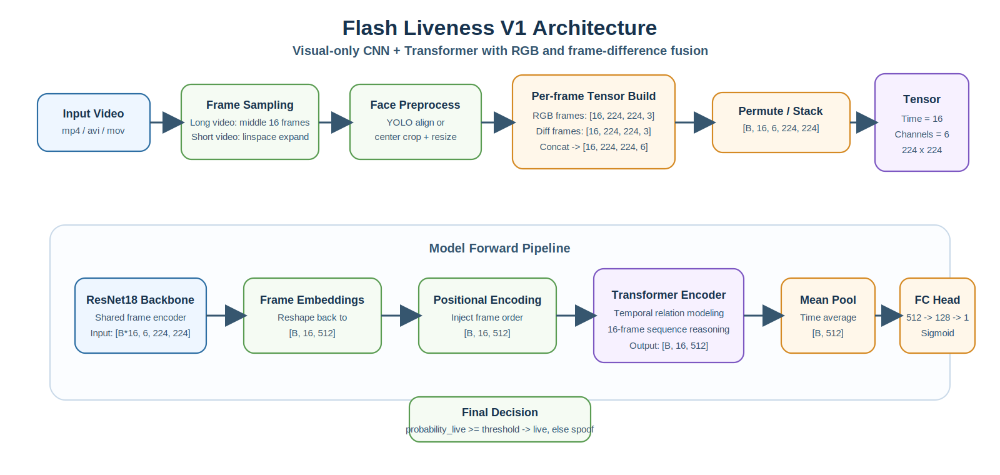
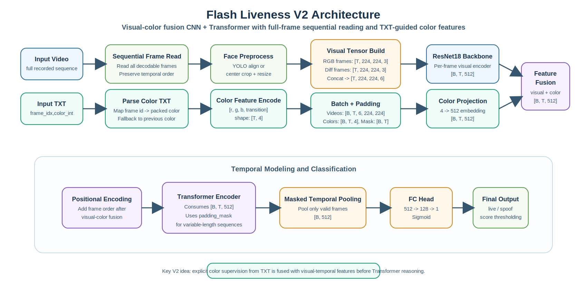

# Flash Liveness Project 使用说明

`flash_liveness_project.py` 是本仓库中的闪光活体检测训练与推理脚本，用于判断输入人脸视频是真人活体还是假人/攻击样本。脚本以视频帧序列为核心输入，结合空间纹理和帧间变化特征，训练一个轻量 CNN + Transformer 二分类模型。

当前已训练模型示例：

```text
flash_liveness_runs/flash_liveness_gpu1_localresnet_e20_manual/best_flash_liveness_model.pth
```

## 模型结构图

### V1 结构图



### V2 结构图



## 核心思路

模型不是只看单张静态人脸，而是读取一段视频中的连续帧。默认配置会从每个视频中采样 `16` 帧，每帧处理成 `224x224` 人脸图，并额外计算相邻帧差分。

最终模型输入形状为：

```text
[batch, num_frames, channels, height, width]
[B, 16, 6, 224, 224]
```

其中 `6` 个通道由两部分组成：

```text
RGB 3通道 + 帧间差分 diff 3通道
```

更准确地说，代码里的构造过程在 [`flash_liveness_project.py`](/supercloud/llm-code/scc/scc/Liveness_Detection/flash_liveness_project.py) 中是：

```python
frames = np.asarray(frames_rgb, dtype=np.float32) / 255.0
diff_frames = np.zeros_like(frames)
if len(frames) > 1:
    diff_frames[1:] = frames[1:] - frames[:-1]
    diff_frames[0] = diff_frames[1]

multi_modal_frames = np.concatenate([frames, diff_frames], axis=-1)
tensor_frames = torch.from_numpy(multi_modal_frames).permute(0, 3, 1, 2).float()
```

也就是：

```text
原始 RGB 帧序列:         [T, H, W, 3]
相邻帧差分序列:          [T, H, W, 3]
拼接后的 6 通道序列:     [T, H, W, 6]
送入 PyTorch 后:         [T, 6, H, W]
DataLoader 再堆成 batch: [B, T, 6, H, W]
```

在默认配置下：

```text
T = 16
H = 224
W = 224
```

所以一个样本的真实 tensor 形状是：

```text
[16, 6, 224, 224]
```

一个 batch 的 tensor 形状是：

```text
[B, 16, 6, 224, 224]
```

如果把单个时间步拆开看，第 `t` 帧的 6 个通道可以写成：

```text
channel 0: R_t
channel 1: G_t
channel 2: B_t
channel 3: R_t - R_{t-1}
channel 4: G_t - G_{t-1}
channel 5: B_t - B_{t-1}
```

第一帧因为没有前一帧，代码里直接令：

```text
diff[0] = diff[1]
```

这是为了避免第 1 帧的差分全为 0，导致首帧和后续帧的统计分布过于割裂。

判断规则为：

```text
probability_live >= threshold  => live  真人/活体
probability_live <  threshold  => spoof 假人/攻击
```

`threshold` 会保存在 checkpoint 中，默认推理时自动读取。

## 创新点

1. 空间纹理 + 时序变化联合建模

   普通单图活体模型容易只学习到脸部纹理、屏幕边缘、打印纹理等静态线索。本脚本将 RGB 图像和相邻帧差分拼接成 6 通道输入，让模型同时看到人脸外观和帧间变化，对闪光、屏幕翻拍、头模等场景更敏感。

   从算法上看，这并不是“往输入里硬塞 3 个额外通道”，而是在显式提供两类互补信息：

   - `RGB` 通道负责表达静态外观：肤色、纹理、边缘、反光、屏幕摩尔纹、打印材质等。
   - `diff` 通道负责表达动态变化：亮度变化方向、局部反射变化、微小运动、闪光切换带来的响应差异。

   这两类信息并不冲突，因为：

   - `diff = frame_t - frame_{t-1}` 不是随机噪声，而是由原始帧确定性计算出的时序特征。
   - 它没有替换掉原始 RGB，而是与 RGB 并行保留，所以模型既能看“当前长什么样”，也能看“和上一帧相比发生了什么变化”。
   - 对活体检测而言，很多判别线索本来就不只存在于静态纹理里，而存在于“变化模式”里。例如真人皮肤、屏幕翻拍、纸张、头模在光照变化时的响应并不相同。

   可以把它理解成一种轻量的“显式运动编码”。相比让网络只靠后面的 Transformer 自己从纯 RGB 序列中慢慢学出帧间变化，直接提供差分通道通常能让模型更容易收敛到与时序相关的判别模式。

2. 为什么不会“影响输入结果”，反而可能学到更多信息

   这里的“不影响输入结果”更准确地说，是“不破坏原始判别信息”。原因是：

   - 原始 3 个 RGB 通道完整保留，没有丢失。
   - 新增的 3 个 diff 通道只是附加信息，不会覆盖 RGB。
   - ResNet 第一层卷积本来就会对所有输入通道做联合线性组合，因此它天然可以学习：
     - 只看 RGB 的卷积核
     - 只看 diff 的卷积核
     - 同时看 RGB 和 diff 的卷积核

   也就是说，网络有能力自己决定“哪些通道更有用”。如果某些 diff 信息没价值，卷积权重可以把它压小；如果某些动态变化很关键，卷积和后续 Transformer 就会把这部分模式强化出来。

3. 一个具体的 tensor 直观示意

   单样本在进入 CNN 前，可以把它想象成这样：

```text
sample tensor
shape = [16, 6, 224, 224]

time step 0  -> [R0, G0, B0, dR0, dG0, dB0]
time step 1  -> [R1, G1, B1, dR1, dG1, dB1]
time step 2  -> [R2, G2, B2, dR2, dG2, dB2]
...
time step 15 -> [R15, G15, B15, dR15, dG15, dB15]
```

   放进模型时，`FlashLivenessModel.forward()` 先接收：

```text
[B, 16, 6, 224, 224]
```

   然后在代码里会 reshape 成：

```text
[B * 16, 6, 224, 224]
```

   让 CNN 逐帧提特征；再把每帧特征还原回：

```text
[B, 16, embed_dim]
```

   最后交给 Transformer 去做 16 帧之间的时序关系建模。

4. CNN 提取局部视觉特征，Transformer 建模时间关系

   每一帧先经过 ResNet18 backbone 提取空间特征，然后把 16 帧特征送入 Transformer Encoder。CNN 负责局部纹理、边缘、反光等视觉线索，Transformer 负责跨帧融合和时间维度判断。

5. 兼容人脸检测和无检测回退

   `FacePreprocessor` 支持接入 YOLOv7 人脸检测与对齐。如果没有提供检测模型，脚本会自动退回中心裁剪和 resize，保证训练/推理流程可以先跑通。

6. V1 的 16 帧采样策略

   V1 在 [`flash_liveness_project.py`](/supercloud/llm-code/scc/scc/Liveness_Detection/flash_liveness_project.py) 中不会顺序读取整段视频，而是先根据总帧数生成 `16` 个目标帧索引，再按这些索引去读取。

   核心逻辑在：

   - [`sample_frame_indices(...)`](/supercloud/llm-code/scc/scc/Liveness_Detection/flash_liveness_project.py#L98)
   - [`_read_sampled_frames(...)`](/supercloud/llm-code/scc/scc/Liveness_Detection/flash_liveness_project.py#L321)
   - [`_read_frame_with_fallback(...)`](/supercloud/llm-code/scc/scc/Liveness_Detection/flash_liveness_project.py#L301)

   采样规则如下：

   - 当 `total_frames <= 0` 时，直接返回 `16` 个索引 `0`
   - 当 `total_frames <= 16` 时，使用 `np.linspace(0, total_frames - 1, 16, dtype=int)` 在整段视频范围内均匀铺开 `16` 个索引
   - 当 `total_frames > 16` 时，不做全局均匀抽样，而是取视频中间连续的 `16` 帧

   对于长视频，代码实际是：

```python
start_idx = max((total_frames - num_frames) // 2, 0)
indices = list(range(start_idx, start_idx + num_frames))
```

   例如：

   - `30` 帧视频 -> 取中间连续 `16` 帧，即大约 `7 ~ 22`
   - `100` 帧视频 -> 取中间连续 `16` 帧，即大约 `42 ~ 57`

   这说明 V1 的采样依据是“视频总长度和中间区域位置”，而不是：

   - 按 `txt` 闪光颜色标签采样
   - 按颜色切换瞬间采样
   - 按运动强弱采样
   - 随机采样

   另外，V1 读取目标帧时还有一层坏帧容错机制。对于每个目标帧索引，代码会按以下顺序尝试读取：

   - 当前目标帧
   - 前 `1` 帧 / 后 `1` 帧
   - 前 `2` 帧 / 后 `2` 帧
   - 前 `3` 帧 / 后 `3` 帧

   只要附近存在可解码帧，就会拿最近的有效帧来替代坏帧。

   如果最后成功读到的有效帧仍然不足 `16` 张，V1 会重复最后一张有效帧，把序列补齐到固定长度 `16`。这样做的主要目的有两个：

   - 保持每个样本输入形状固定，方便 batch 训练
   - 尽量避免因局部坏帧导致整段视频直接失效

   因此，V1 的 16 帧策略可以概括为：

```text
长视频：取中间连续 16 帧
短视频：均匀展开到 16 个索引
坏帧：用目标帧附近的可用帧替代
不足：重复最后一帧补齐
```

   这套策略简单、稳定、工程上容易落地，但缺点也很明确：它没有显式利用闪光协议和逐帧颜色标签，所以对闪光切换瞬间、颜色迟滞效应、rPPG 波动等更细粒度的时序模式利用有限。这也是 V2 改为“顺序读取全部可解码帧 + 使用同名 `.txt` 颜色序列”的主要原因。

7. 自动处理短视频和坏视频

   当视频帧数不足时，会按采样逻辑补齐到 `num_frames`。如果视频完全无法解码，会跳过该样本并记录到 `skipped_corrupted_samples.txt`，避免训练被个别坏文件中断。

8. 自动类别不均衡权重

   默认 `--pos-weight auto` 会按训练集中的 `spoof/live` 比例设置 BCE 正类权重，减轻真人和攻击样本数量不平衡带来的偏置。

9. 保存完整实验产物

   每次训练会保存 `run_config.json`、`metrics_history.csv`、`metrics_history.jsonl`、`training_summary.json`、`best_flash_liveness_model.pth` 和 `last_flash_liveness_model.pth`，方便复现、续训和比较实验。

## 数据目录格式

推荐使用显式 train/val/test 划分：

```text
dataset/flash_liveness_video_dataset_v1/
  train/
    live/
      xxx.mp4
    spoof/
      yyy.mp4
  val/
    live/
    spoof/
  test/
    live/
    spoof/
```

也可以只提供：

```text
data_root/
  live/
  spoof/
```

脚本会按照 `--val-ratio` 和 `--test-ratio` 自动分层划分。

支持的正类目录名包括：

```text
live, real, bonafide, bona_fide, genuine, 真人
```

支持的负类目录名包括：

```text
spoof, fake, attack, imposter, print, replay, mask, 头模, 攻击
```

支持视频扩展名：

```text
.mp4, .avi, .mov, .mkv, .webm, .m4v
```

## 环境

仓库中已有使用过的 Python 环境路径：

```bash
conda activate anti-spoofing_scc_175
cd /supercloud/llm-code/scc/scc/Liveness_Detection
```

也可以直接使用环境内 Python：

```bash
/home/scc/anaconda3/envs/anti-spoofing_scc_175/bin/python
```

## 训练

示例训练命令：

```bash
cd /supercloud/llm-code/scc/scc/Liveness_Detection

/home/scc/anaconda3/envs/anti-spoofing_scc_175/bin/python flash_liveness_project.py train \
  --data-root /supercloud/llm-code/scc/scc/Liveness_Detection/dataset/flash_liveness_video_dataset_v1 \
  --output-dir /supercloud/llm-code/scc/scc/Liveness_Detection/flash_liveness_runs/flash_liveness_gpu1_localresnet_e20_manual \
  --epochs 20 \
  --batch-size 8 \
  --num-workers 4 \
  --num-frames 16 \
  --image-size 224 \
  --learning-rate 1e-4 \
  --weight-decay 1e-2 \
  --log-interval 20 \
  --pos-weight auto \
  --device cuda:1 \
  --use-imagenet-pretrained \
  --imagenet-pretrained-path /supercloud/llm-code/scc/scc/Liveness_Detection/resnet18-f37072fd.pth
```

如果需要使用人脸检测模型：

```bash
--detector-model /path/to/yolov7_face.pt \
--detector-device cuda:1
```

如果不传 `--detector-model`，会使用中心裁剪。

## 续训

从上一次 checkpoint 继续训练：

```bash
/home/scc/anaconda3/envs/anti-spoofing_scc_175/bin/python flash_liveness_project.py train \
  --data-root /supercloud/llm-code/scc/scc/Liveness_Detection/dataset/flash_liveness_video_dataset_v1 \
  --output-dir /supercloud/llm-code/scc/scc/Liveness_Detection/flash_liveness_runs/flash_liveness_gpu1_localresnet_e20_manual \
  --resume-checkpoint /supercloud/llm-code/scc/scc/Liveness_Detection/flash_liveness_runs/flash_liveness_gpu1_localresnet_e20_manual/last_flash_liveness_model.pth \
  --epochs 30 \
  --batch-size 8 \
  --num-workers 4 \
  --device cuda:1
```

注意：`--epochs` 是总 epoch 数，不是额外训练多少轮。如果 checkpoint 已训练到第 20 轮，想再训练 10 轮，需要设置 `--epochs 30`。

## 单视频推理

```bash
/home/scc/anaconda3/envs/anti-spoofing_scc_175/bin/python flash_liveness_project.py infer \
  --checkpoint /supercloud/llm-code/scc/scc/Liveness_Detection/flash_liveness_runs/flash_liveness_gpu1_localresnet_e20_manual/best_flash_liveness_model.pth \
  --video-path /path/to/input.mp4 \
  --device cuda:0
```

输出示例：

```json
{
  "video_path": "/path/to/input.mp4",
  "probability_live": 0.999991,
  "threshold": 0.000003,
  "prediction": "live"
}
```

## 批量测试视频

仓库中提供了评估脚本：

```text
scripts/evaluate_flash_liveness_checkpoint.py
```

测试 test 划分：

```bash
PYTHONUNBUFFERED=1 /home/scc/anaconda3/envs/anti-spoofing_scc_175/bin/python scripts/evaluate_flash_liveness_checkpoint.py \
  --checkpoint /supercloud/llm-code/scc/scc/Liveness_Detection/flash_liveness_runs/flash_liveness_gpu1_localresnet_e20_manual/best_flash_liveness_model.pth \
  --data-root /supercloud/llm-code/scc/scc/Liveness_Detection/dataset/flash_liveness_video_dataset_v1 \
  --split test \
  --output-dir /supercloud/llm-code/scc/scc/Liveness_Detection/flash_liveness_runs/flash_liveness_gpu1_localresnet_e20_manual/inference_test_outputs_full \
  --batch-size 8 \
  --device cuda:0 \
  --save-debug-samples 12
```

主要输出：

```text
predictions.csv
predictions.jsonl
summary.json
debug_sample_frames/
skipped_or_failed_samples.txt
```

`predictions.csv` 中每一行对应一个视频，包含 `probability_live`、`threshold`、`prediction_name`、`label_name`、`correct`、`status` 和 `error`。

## 批量图片推理

严格来说，`flash_liveness_project.py` 训练的是视频/帧序列模型。单张图片没有真实时序变化，因此图片推理只能作为兼容方案使用：脚本会把单张图片复制成 `16` 帧，并生成全 0 的差分通道。

本仓库已提供图片批量推理脚本：

```text
scripts/infer_flash_liveness_images.py
```

运行方式：

```bash
/home/scc/anaconda3/envs/anti-spoofing_scc_175/bin/python scripts/infer_flash_liveness_images.py \
  --checkpoint /supercloud/llm-code/scc/scc/Liveness_Detection/flash_liveness_runs/flash_liveness_gpu1_localresnet_e20_manual/best_flash_liveness_model.pth \
  --image-root /path/to/images \
  --output-dir /supercloud/llm-code/scc/scc/Liveness_Detection/flash_liveness_runs/flash_liveness_gpu1_localresnet_e20_manual/batch_image_outputs \
  --device cuda:0 \
  --batch-size 32 \
  --save-preprocessed
```

如果希望单张图片也模拟闪光活体的 16 帧输入，可以启用 flash 序列合成。默认会每 4 帧切换一次颜色，16 帧对应：

```text
normal, normal, normal, normal,
red, red, red, red,
green, green, green, green,
blue, blue, blue, blue
```

命令示例：

```bash
/home/scc/anaconda3/envs/anti-spoofing_scc_175/bin/python scripts/infer_flash_liveness_images.py \
  --checkpoint /supercloud/llm-code/scc/scc/Liveness_Detection/flash_liveness_runs/flash_liveness_gpu1_localresnet_e20_manual/best_flash_liveness_model.pth \
  --image-root /path/to/images \
  --output-dir /path/to/image_flash_outputs \
  --device cuda:0 \
  --batch-size 32 \
  --static-sequence-mode flash \
  --flash-group-size 4 \
  --flash-colors normal,red,green,blue \
  --flash-alpha 0.25
```

如果文件名中包含 `true` 表示真人，否则表示假人/攻击，可以同时输出标签、自动阈值和 `correct` 字段：

```bash
/home/scc/anaconda3/envs/anti-spoofing_scc_175/bin/python scripts/infer_flash_liveness_images.py \
  --checkpoint /supercloud/llm-code/scc/scc/Liveness_Detection/flash_liveness_runs/flash_liveness_gpu1_localresnet_e20_manual/best_flash_liveness_model.pth \
  --image-root /path/to/preprocessed_224 \
  --output-dir /path/to/preprocessed_224_flash_labeled_eval \
  --device cuda:0 \
  --batch-size 32 \
  --static-sequence-mode flash \
  --flash-group-size 4 \
  --flash-colors normal,red,green,blue \
  --flash-alpha 0.25 \
  --label-from-name \
  --real-name-token true \
  --score-mode minmax \
  --auto-orient-score \
  --auto-threshold
```

输出：

```text
image_predictions.csv
image_predictions.jsonl
summary.json
preprocessed_224/
```

如果图片已经是人脸 crop，可以不传检测模型。如果是原始大图，建议传入检测模型：

```bash
--detector-model /path/to/yolov7_face.pt \
--detector-device cuda:0
```

## 输出文件说明

训练输出目录中常见文件：

```text
best_flash_liveness_model.pth      验证集 AUC 最优的 checkpoint
last_flash_liveness_model.pth      最后一个 epoch 的 checkpoint
run_config.json                    本次运行参数和数据划分统计
metrics_history.csv                每个 epoch 的关键指标
metrics_history.jsonl              每个 epoch 的 JSONL 指标
training_summary.json              最优模型对应的汇总指标
skipped_corrupted_samples.txt      解码失败或无法读取有效帧的视频
```

checkpoint 内保存内容包括：

```text
model_state_dict
optimizer_state_dict
threshold
config
split_counts
train_metrics
val_metrics
test_metrics
resolved_pos_weight
```

其中 `config` 会记录推理所需的关键模型参数，例如：

```text
num_frames
embed_dim
num_heads
num_layers
target_size
```

因此推理脚本不需要手动重复这些结构参数，会自动从 checkpoint 中读取。

## 关键参数

`--num-frames`

每个视频采样多少帧，默认 `16`。训练和推理必须保持一致，推理时会从 checkpoint 自动读取。

`--image-size`

输入人脸尺寸，默认 `224`，最终为 `224x224`。

`--batch-size`

训练或推理 batch size。显存不足时调小。

`--device`

指定运行设备，例如 `cuda:0`、`cuda:1` 或 `cpu`。

`--pos-weight`

BCE 正类权重。默认 `auto`，按训练集中 `spoof/live` 数量比例自动设置。

`--threshold`

推理阈值。默认使用 checkpoint 中保存的验证集最佳阈值。需要人工调业务阈值时可以覆盖。

`--detector-model`

可选人脸检测/对齐模型路径。不提供时使用中心裁剪。

## 注意事项

1. 训练效果好不等于图片推理同样可靠

   当前模型的优势来自视频帧序列和差分通道。单张图片推理时差分信息为空，最好只作为快速筛查或兼容接口使用。正式活体判断更建议输入短视频或连续帧。

2. 训练和推理预处理必须一致

   如果训练时没有使用人脸检测，推理时突然加入检测模型，输入分布可能变化；反之亦然。最好保持同一种预处理策略。

3. 阈值需要结合业务误判成本调整

   checkpoint 保存的是验证集上自动选择的阈值。实际业务中如果更怕假人通过，可以提高安全策略并重新评估 APCER/BPCER/ACER。

4. 检查 debug 输入图

   批量评估时可以打开 `debug_sample_frames/`，图片推理时可以打开 `preprocessed_224/`，确认模型实际看到的是人脸而不是背景、遮罩或空图。

## 快速检查命令

查看训练结果：

```bash
cat flash_liveness_runs/flash_liveness_gpu1_localresnet_e20_manual/training_summary.json
```

查看批量推理 CSV 前几行：

```bash
head -20 flash_liveness_runs/flash_liveness_gpu1_localresnet_e20_manual/batch_image_outputs/image_predictions.csv
```

查看脚本参数：

```bash
/home/scc/anaconda3/envs/anti-spoofing_scc_175/bin/python flash_liveness_project.py --help
/home/scc/anaconda3/envs/anti-spoofing_scc_175/bin/python flash_liveness_project.py train --help
/home/scc/anaconda3/envs/anti-spoofing_scc_175/bin/python flash_liveness_project.py infer --help
/home/scc/anaconda3/envs/anti-spoofing_scc_175/bin/python scripts/evaluate_flash_liveness_checkpoint.py --help
/home/scc/anaconda3/envs/anti-spoofing_scc_175/bin/python scripts/infer_flash_liveness_images.py --help
```
