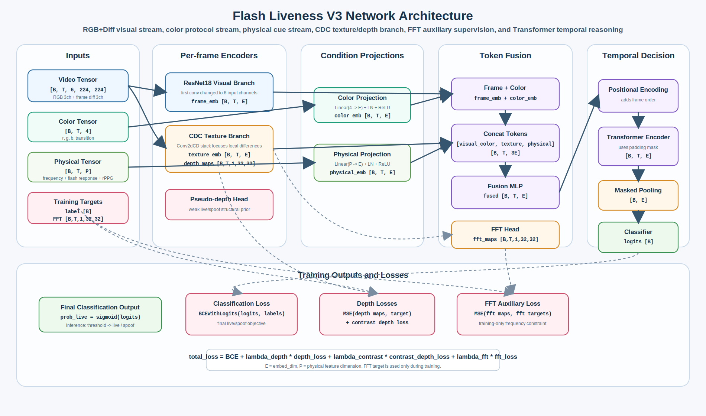
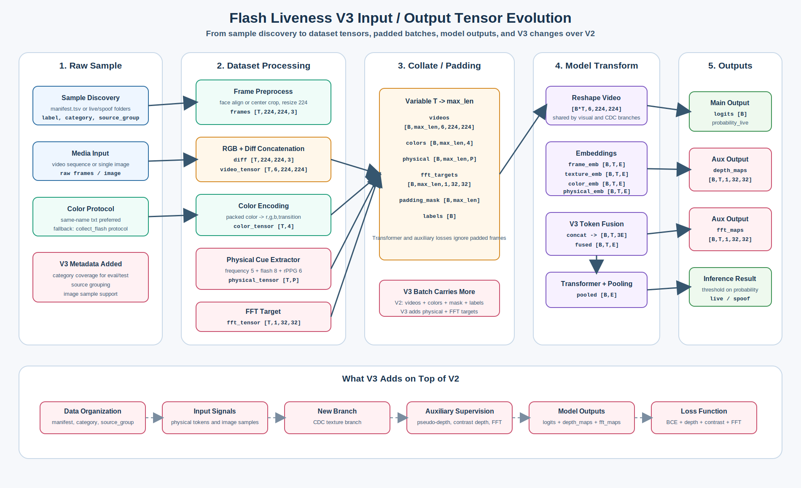

# Flash Liveness Project V3 说明

`flash_liveness_project_v3.py` 是炫彩活体检测训练与推理脚本的 V3 版本。它以 V2 的“视频 RGB+Diff + 逐帧闪光颜色 + Transformer 时序建模”为基础，进一步吸收 CDCN、MiniFASNet V2 和项目内 `flash_physical_features.py` 的思路，加入局部差分纹理、伪深度、频域辅助监督和闪光物理特征。

V3 的目标不是把炫彩活体变成普通静默活体，而是让模型同时学习：

- 真人皮肤/血液/三维结构在固定炫彩打光下的动态响应。
- 纸张、屏幕、手机回放、剪裁纸面在切光时的反射和频域伪影。
- 硅胶、乳胶、面具、头模等 3D 攻击的材质和伪深度异常。
- 不同设备、不同光照、不同采集环境下的未知攻击泛化能力。

## 模型结构图

### V3 网络结构图



### V3 输入输出变化图



### V3 完整技术分析

完整处理链路、每一步技术依据、tensor 变化和相关论文/项目引用见 [`FLASH_LIVENESS_PROJECT_V3_TECHNICAL_ANALYSIS.md`](FLASH_LIVENESS_PROJECT_V3_TECHNICAL_ANALYSIS.md)。

## 核心数据流

V3 的完整处理链路如下：

```text
manifest.tsv / live|spoof 目录
        |
发现视频/图片样本，记录 label、category、source_group
        |
优先读取同名 txt 逐帧颜色；缺失时可生成 collect_flash 固定协议颜色
        |
顺序读取视频全部可解码帧，或读取单张图片
        |
人脸检测/对齐，失败则中心裁剪
        |
resize 到 224x224
        |
BGR 转 RGB，归一化到 [0, 1]
        |
计算相邻帧差分 diff
        |
拼接 6 通道图像特征: RGB 3通道 + diff 3通道
        |
颜色整数转成 [r, g, b, transition]
        |
提取 physical features: 频域/闪光响应/rPPG 等逐帧物理 token
        |
生成 FFT 辅助监督 target: [T, 1, 32, 32]
        |
DataLoader 对不同长度样本做 padding
        |
ResNet18 主视觉分支提取 frame embedding
        |
CDC texture branch 提取局部差分纹理 embedding 和 pseudo-depth map
        |
color_proj 提取颜色 embedding
        |
physical_proj 提取物理特征 embedding
        |
融合 frame/color/texture/physical token
        |
Positional Encoding + Transformer Encoder 建模时序关系
        |
有效帧 masked pooling
        |
分类输出 live/spoof
        |
联合训练: BCE 分类 + pseudo-depth + contrast depth + FFT 辅助损失
```

模型输入包含四部分：

```text
video tensor:    [B, T, 6, H, W]
color tensor:    [B, T, 4]
physical tensor: [B, T, P]
fft target:      [B, T, 1, 32, 32]
```

其中：

```text
B = batch size
T = 当前 batch 内 padding 后的最大帧数
6 = RGB 3通道 + 帧间差分 3通道
4 = 闪光颜色 r,g,b + transition 切换标记
P = physical feature 维度，默认来自 flash_physical_features.py
```

每个样本原始返回值是：

```text
video_tensor:    [T, 6, 224, 224]
color_tensor:    [T, 4]
physical_tensor: [T, P]
fft_tensor:      [T, 1, 32, 32]
label:           []
```

## 数据加载方式

V3 支持两种数据组织方式。

### 1. manifest 归档数据集

推荐使用当前资产归档格式：

```text
dataset/flash_liveness_asset_archive_by_type/
  manifest.tsv
  videos/
    live_real_flash_archive/
    flat_attack_flash_archive/
    replay_mobile_attack/
    silicone_mask_attack/
    three_d_head_model_attack_flash_archive/
    ...
  images/
    live_real_image_flash_archive/
    print_attack_flash_archive/
    screen_replay_attack_flash_archive/
    ...
```

`manifest.tsv` 至少需要这些字段：

```text
media_type  label  category  source_group  archive_path  source_path  note
```

V3 会优先从 `manifest.tsv` 读取样本，并把每个样本封装成：

```text
LivenessSample(
  media_path,
  txt_path,
  label,
  media_type,
  category,
  source_group,
)
```

其中：

- `media_path`: 当前训练读取的视频或图片路径。
- `txt_path`: 同名逐帧颜色文件，可为空。
- `label`: `live=1`, `spoof=0`。
- `media_type`: `videos` 或 `images`。
- `category`: 攻击类型或真实样本类型，例如 `replay_mobile_attack`。
- `source_group`: 数据来源分组。

V3 的自动切分不是只按 live/spoof 分层，而是按：

```text
label + media_type + category
```

分层切分 train/val/test。这样可以尽量保证纸张、屏幕、头模、面具、硅胶等攻击类型都进入各个 split，而不是被随机切分打散到某一个集合。

### 验证集/测试集的 category 覆盖原则

V3 的 `val` 和 `test` 不应只看整体 live/spoof 比例，还需要覆盖每一种攻击类型。尤其是 `test`，它应当是普适性的测试数据集，用来回答：

```text
模型对所有已知攻击类型是否都有基本检测能力？
```

而不是只评估某几个样本量大的特殊攻击。

因此 V3 的划分逻辑按 `label + media_type + category` 分组，并且对每个样本数足够的 category 尽量保证：

```text
train 至少有样本用于学习
val 至少有样本用于调参与阈值选择
test 至少有样本用于最终普适评估
```

需要注意一个不可避免的约束：

```text
如果某个 category 总样本数 < 3，
则无法在不重复样本、不造成数据泄漏的前提下同时覆盖 train/val/test。
```

当前固定顺序炫光派生数据集中，视频样本的每个 category 都能进入 `train`、`val` 和 `test`。训练启动时 V3 会打印 category coverage，并把结果写入 `run_config.json`：

```text
train category coverage: 22/22, missing=none
val category coverage:   22/22, missing=none
test category coverage:  22/22, missing=none
```

如果后续新增 category，仍建议每类攻击至少满足：

```text
每个 category >= 3 个样本
```

更理想的目标是：

```text
每个 category >= 10 个样本
```

这样 `val/test` 才能更稳定地反映该攻击类型的泛化表现。

### 2. live|spoof 目录数据集

V3 也兼容旧格式：

```text
data_root/
  train/
    live/
    spoof/
  val/
    live/
    spoof/
  test/
    live/
    spoof/
```

或者只提供：

```text
data_root/
  live/
  spoof/
```

脚本会按 `--val-ratio` 和 `--test-ratio` 自动切分。

## 固定顺序炫光协议数据集

为了让 V3 更稳定地学习“同一炫光协议下真假人脸的细微响应差异”，建议主训练集使用固定顺序打光协议，而不是把随机颜色 txt 作为主监督。

已构建派生数据集：

```text
dataset/flash_liveness_asset_archive_fixed_collect_protocol/
```

这个数据集不会修改源视频，也不会覆盖源随机颜色 txt。它的做法是：

```text
源视频 -> 软链接到派生目录
每个视频 -> 重新生成固定顺序同名 txt
manifest.tsv -> 指向派生目录中的视频
```

固定颜色顺序来自 `scripts/collect_flash_liveness_video.py`：

```text
(255, 20, 255) -> (20, 255, 20) -> (255, 20, 20)
```

对应 packed int：

```text
16717055 -> 1376020 -> 16716820
```

默认时间协议：

```text
warmup: 1.0s 黑屏
hold:   0.35s 每种颜色保持时间
tail:   0.5s 黑屏收尾
```

训练推荐命令：

```bash
conda run -n anti-spoofing_scc_175 python flash_liveness_project_v3.py train \
  --data-root dataset/flash_liveness_asset_archive_fixed_collect_protocol \
  --dataset-media videos \
  --require-color-txt
```

如果直接训练原始归档，也可以使用：

```bash
conda run -n anti-spoofing_scc_175 python flash_liveness_project_v3.py train \
  --data-root dataset/flash_liveness_asset_archive_by_type \
  --dataset-media videos \
  --missing-color-protocol collect_flash
```

其中 `--missing-color-protocol collect_flash` 表示：当视频没有同名 txt 时，根据视频 fps 和 frame_count 生成固定 collect_flash 颜色序列。

## txt 颜色信息如何进入模型

V3 的颜色 txt 支持两种格式：

```text
frame_idx,color_int
```

例如：

```text
0,16717055
1,16717055
2,1376020
```

也兼容每行只有颜色值的短格式：

```text
16717055
1376020
16716820
```

每个 packed RGB 颜色会被转成 4 维特征：

```text
[r, g, b, transition]
```

其中：

- `r, g, b`: 将 packed int 拆成 RGB 并归一化到 `[0, 1]`。
- `transition`: 当前帧颜色是否相对上一帧发生变化。

例如固定协议中的紫色：

```text
packed = 16717055
RGB = (255, 20, 255)
feature = [1.0, 0.0784, 1.0, transition]
```

颜色 tensor 形状变化：

```text
每帧颜色 int
        |
color_int_to_feature
        |
[T, 4]
        |
DataLoader padding
        |
[B, T, 4]
        |
color_proj: Linear(4 -> embed_dim)
        |
[B, T, embed_dim]
```

颜色信息的作用是显式告诉模型：

```text
当前帧处在什么光色条件下
当前帧是不是切光瞬间
```

这对炫彩活体很关键，因为真假材质的差异经常不是静态外观本身，而是同一个光色切换过程中的响应差异。

## 6 通道视频 tensor 如何构建

每个视频顺序读取全部可解码帧，或者由 `--max-train-frames` / `--max-eval-frames` 限制最大帧数。

单帧处理流程：

```text
BGR frame
        |
人脸检测/对齐，失败中心裁剪
        |
resize 224x224
        |
BGR -> RGB
        |
float32 / 255.0
```

得到 RGB 序列：

```text
frames: [T, H, W, 3]
```

再计算相邻帧差分：

```text
diff_frames[1:] = frames[1:] - frames[:-1]
diff_frames[0] = diff_frames[1]
```

得到：

```text
diff_frames: [T, H, W, 3]
```

然后在通道维拼接：

```text
multi_modal_frames = concat([frames, diff_frames], axis=-1)
```

形状变化：

```text
frames:             [T, 224, 224, 3]
diff_frames:        [T, 224, 224, 3]
multi_modal_frames: [T, 224, 224, 6]
permute:            [T, 6, 224, 224]
```

加上 batch 后：

```text
video tensor: [B, T, 6, 224, 224]
```

6 个通道分别可以理解为：

```text
[R, G, B, dR, dG, dB]
```

其中：

- `RGB` 负责当前帧外观。
- `Diff` 负责切光、反射、运动、屏幕刷新、纸面高光变化等动态信息。

### 为什么要计算相邻帧差分 diff

炫彩活体不是单帧分类任务。核心信息往往出现在：

```text
同一个人脸区域在相邻时间、相邻光色条件下发生了什么变化
```

因此 V3 显式构建：

```text
diff[t] = frame[t] - frame[t-1]
```

并把它和当前 RGB 帧拼成 6 通道输入。

diff 图的作用可以分成几类。

1. 强化切光瞬间的光学响应

固定炫彩协议会在紫、绿、红之间切换。真人皮肤、屏幕、打印纸、硅胶、头模对切光的响应速度和幅度不同。RGB 单帧只能看到“当前亮不亮、颜色是什么”，diff 会直接突出：

```text
切光后哪些区域变亮
哪些区域变暗
变化是否均匀
变化是否滞后
```

2. 捕捉材质反射差异

不同攻击介质的反射特性不同：

- 屏幕会出现整体同步亮度变化、刷新纹、像素栅格变化。
- 打印纸可能出现纸面漫反射和局部高光。
- 硅胶/乳胶/面具可能有不自然的镜面反射或局部色偏。
- 真实皮肤通常有更复杂的亚表面散射和局部颜色响应。

diff 图会把这些“变化模式”放大，让模型更容易比较真假材质。

3. 降低对静态外观的过拟合

只看 RGB，模型可能学到背景、脸型、采集设备、分辨率、攻击道具外观等捷径。加入 diff 后，模型被迫关注：

```text
在固定光色切换下，这个区域实际怎么变化
```

这比只看某一帧长什么样更贴合炫彩活体。

4. 帮助 Transformer 建模时间关系

Transformer 负责长时序关系，但它接收的是每帧 token。diff 相当于在每个时间步提前提供一个局部时间导数：

```text
当前状态 RGB + 最近变化 Diff
```

这样 Transformer 不必完全从多帧 RGB 中自己推断短期变化，能把更多容量用于学习长时间的切光响应、稳定阶段、迟滞和周期模式。

5. 对轻微运动和采集抖动更敏感

真人采集时会有自然微动，攻击视频/纸张/屏幕也会有手持抖动或平面整体移动。diff 不是专门的运动光流，但可以提供弱运动信息，辅助判断：

```text
变化是来自真实三维人脸和皮肤响应，
还是来自平面介质整体移动、屏幕刷新、纸张反光
```

所以 V3 中的 6 通道输入不是简单增加通道数，而是把静态外观和短时动态响应放在同一个像素位置上联合建模。

## physical features 如何构建

V3 默认启用 `flash_physical_features.py` 中的物理线索提取：

```python
PhysicalFeatureConfig(
  use_frequency=True,
  use_flash_response=True,
  use_rppg=True,
  use_depth_normal=False,
)
```

它根据 RGB 帧序列和逐帧颜色值生成：

```text
physical_tensor: [T, P]
```

默认情况下：

```text
P = 5 + 8 + 6 = 19
```

也就是每一帧会生成 19 维 physical token。

### 1. Frequency/texture features，5 维

这组特征来自 `FrequencyArtifactExtractor`，用于描述屏幕、打印、纸张、头模表面常见的频域和纹理异常：

```text
0. freq_high_energy
1. freq_mid_energy
2. freq_lap_var
3. freq_row_periodicity
4. freq_col_periodicity
```

含义：

- `freq_high_energy`: 高频能量比例。屏幕像素栅格、打印网点、锐化边缘常会提高高频能量。
- `freq_mid_energy`: 中频能量比例。纸纹、屏幕摩尔纹、材质纹理常体现在中频区域。
- `freq_lap_var`: Laplacian 方差，衡量局部锐利程度和边缘强度。翻拍屏幕、打印照片、纸面裁剪边缘可能异常。
- `freq_row_periodicity`: 行方向亮度 profile 的周期/抖动强度。屏幕刷新、扫描纹、行栅格会影响它。
- `freq_col_periodicity`: 列方向亮度 profile 的周期/抖动强度。用于补充横向纹理和栅格异常。

这 5 维主要帮助模型识别：

```text
屏幕像素结构、打印网点、纸张纹理、头模/面具表面异常纹理
```

### 2. Flash-response features，8 维

这组特征来自 `FlashResponseFeatureExtractor`。`color_tensor` 只告诉模型“发出了什么颜色的光”，而 flash-response features 描述“人脸区域实际怎么响应这个颜色”。

```text
0. flash_r_mean
1. flash_g_mean
2. flash_b_mean
3. flash_intensity
4. flash_delta_intensity
5. flash_transition
6. flash_response_decay
7. flash_chroma_ratio
```

含义：

- `flash_r_mean`: 当前帧人脸区域 R 通道均值。
- `flash_g_mean`: 当前帧人脸区域 G 通道均值。
- `flash_b_mean`: 当前帧人脸区域 B 通道均值。
- `flash_intensity`: RGB 均值的平均亮度。
- `flash_delta_intensity`: 当前帧亮度相对上一帧的变化量。
- `flash_transition`: 当前帧是否发生颜色切换。
- `flash_response_decay`: 一个简单的光学迟滞/衰减代理特征，颜色切换时刷新，稳定阶段按比例衰减。
- `flash_chroma_ratio`: 红绿、蓝绿和色度范围组合，用于描述不同光色下的颜色响应比例。

这 8 维主要帮助模型学习：

```text
同一固定打光协议下，真人皮肤与屏幕/纸张/硅胶/头模的颜色响应幅度、切光瞬间变化、稳定阶段衰减是否不同
```

### 3. rPPG features，6 维

这组特征来自 `RPPGFeatureExtractor`。它不是完整医学意义的心率估计，而是利用绿色通道和局部区域统计提供弱 rPPG/血流响应线索：

```text
0. rppg_mean_g
1. rppg_delta_g
2. rppg_cheek_g
3. rppg_forehead_g
4. rppg_local_energy
5. rppg_fft_peak_score
```

含义：

- `rppg_mean_g`: 全脸绿色通道均值。
- `rppg_delta_g`: 绿色通道均值相对上一帧的变化量。
- `rppg_cheek_g`: 下半脸/脸颊区域绿色通道均值。
- `rppg_forehead_g`: 上半脸/额头区域绿色通道均值。
- `rppg_local_energy`: 绿色通道在局部时间窗口内的波动强度。
- `rppg_fft_peak_score`: 绿色通道时间序列频谱峰值比例，作为周期性弱线索。

这 6 维主要帮助模型补充：

```text
真人皮肤和血液相关的微弱绿色通道时序变化，以及攻击材质中不自然的绿色通道波动
```

### 4. Depth/normal features，默认未启用

代码中还保留了 `DepthNormalFeatureLoader`：

```text
depth_mean
depth_std
depth_range
normal_strength
planarity_score
depth_cv
```

这 6 维需要离线深度图和法线文件，V3 当前配置中：

```text
use_depth_normal=False
```

所以默认不会进入 `physical_tensor`。

这些 token 的作用是给 Transformer 提供更接近物理含义的辅助线索，例如：

- 频域变化。
- 闪光响应强弱。
- 不同颜色刺激下的亮度/颜色变化。
- rPPG 或类 rPPG 的微弱时序信号。

进入模型后：

```text
physical_tensor: [B, T, P]
        |
physical_proj: Linear(P -> embed_dim)
        |
physical_emb: [B, T, embed_dim]
```

如果关闭：

```bash
--no-use-physical-features
```

则 `physical_tensor` 维度为 0，模型使用全 0 的 physical embedding。

## FFT 辅助监督如何构建

V3 为每一帧生成 32x32 的 FFT target：

```text
RGB frame
        |
转灰度
        |
resize 到 32x32
        |
2D FFT
        |
fftshift
        |
log1p(abs(spectrum))
        |
归一化到 [0, 1]
        |
fft target: [1, 32, 32]
```

单样本输出：

```text
fft_tensor: [T, 1, 32, 32]
```

batch 后：

```text
fft_targets: [B, T, 1, 32, 32]
```

FFT 辅助监督的作用：

- 强化屏幕重放的像素栅格、刷新纹理、摩尔纹。
- 强化打印纸张的半色调网点、纸纹和频域噪声。
- 让 CDC texture branch 的 embedding 不只服务分类，也学习频域可解释约束。

注意：FFT map 是训练期辅助监督。推理时模型仍然只需要视频和颜色 txt，不需要外部 FFT 文件。

### 为什么 V3 需要 FFT 辅助监督

V3 的最终任务虽然是 live/spoof 二分类，但很多攻击的关键差异并不总是稳定地出现在 RGB 空间中，而是出现在频域结构中。

典型例子：

- 屏幕回放：像素栅格、刷新纹、摩尔纹、屏幕子像素排列。
- 手机回放：显示屏亮度调制、拍摄屏幕产生的频率混叠。
- 打印攻击：半色调网点、纸张纤维、打印噪声。
- 纸面/剪裁攻击：边缘锐利、局部纹理重复、平面纸张的高频边界。
- 头模/面具：表面纹理过平滑或出现异常材质纹理。

如果只用分类 loss，模型可能学到一些不可控捷径，例如背景、设备、压缩痕迹、样本来源差异。FFT 辅助监督的作用是给 texture branch 一个更明确的训练约束：

```text
你的局部纹理 embedding 应该能够恢复/预测当前帧的频域结构
```

这会带来几个好处。

1. 让 CDC texture branch 更关注纹理和材质

CDC 分支本身擅长局部差分、边缘和梯度。FFT target 进一步告诉它：

```text
不要只服务最终分类，还要保留和频率分布相关的信息
```

这对屏幕、打印和纸张攻击尤其重要。

2. 提供比分类标签更密集的训练信号

分类标签每个视频只有一个：

```text
live/spoof
```

而 FFT target 每一帧都有一个：

```text
[1, 32, 32]
```

也就是说，模型在每一帧上都能得到关于频域结构的监督信号，训练信号更密集。

3. 降低模型只依赖颜色亮度的风险

炫彩活体中，颜色和亮度变化非常强。如果没有额外约束，模型可能过度依赖某些全局亮度变化。FFT loss 迫使模型同时关注：

```text
光照响应 + 局部纹理 + 频域结构
```

这样更不容易被简单调亮、调暗、换设备、换背景干扰。

4. 对未知攻击更友好

很多未知攻击不一定和训练集中的某个道具外观完全一致，但只要它是屏幕、打印、纸张、面具或头模，就往往会在频域和局部纹理上留下异常。FFT 辅助监督有助于模型学习这类更通用的材质线索。

5. 推理时不增加输入成本

FFT target 只在训练时由原始帧在线计算：

```text
frames -> fft_targets
```

推理时模型不会要求用户提供 FFT 文件。模型仍然只需要：

```text
video + txt color protocol
```

因此 FFT 是一种“训练期增强约束”，不是额外的线上输入依赖。

## DataLoader padding 机制

V3 继续支持变长视频。一个 batch 中不同样本的 `T` 可以不同，因此 `collate_skip_none(...)` 会 padding 到 batch 内最大长度。

每个样本返回：

```text
video_tensor:    [T, 6, 224, 224]
color_tensor:    [T, 4]
physical_tensor: [T, P]
fft_tensor:      [T, 1, 32, 32]
label:           []
```

假设一个 batch 中有 3 个视频：

```text
T = 120, 95, 143
```

则：

```text
max_len = 143
```

padding 后：

```text
videos:       [B, 143, 6, 224, 224]
colors:       [B, 143, 4]
physical:     [B, 143, P]
fft_targets:  [B, 143, 1, 32, 32]
padding_mask: [B, 143]
labels:       [B]
```

`padding_mask` 的含义：

```text
False = 真实帧
True  = padding 补齐帧
```

Transformer 使用：

```python
src_key_padding_mask=padding_mask
```

最终池化也只统计有效帧：

```text
valid_mask = ~padding_mask
pooled = sum(trans_out * valid_mask) / sum(valid_mask)
```

所以 V3 的 padding 机制可以概括为：

```text
补齐 video/color/physical/fft
用 padding_mask 标记真实帧和补齐帧
Transformer 和所有辅助 loss 都只看有效帧
```

## 模型模块说明

### 1. ResNet18 主视觉分支

输入：

```text
x: [B, T, 6, 224, 224]
reshape -> [B*T, 6, 224, 224]
```

V3 使用 ResNet18 作为主视觉 backbone，并把第一层改成 6 通道：

```text
Conv2d(6 -> 64, kernel=7, stride=2, padding=3)
```

如果启用 ImageNet 预训练：

- 原 RGB 权重复制到前 3 个通道。
- 同一份 RGB 权重也复制到后 3 个 Diff 通道。

输出：

```text
frame_emb: [B*T, 512]
reshape -> [B, T, embed_dim]
```

作用：

- 学习人脸外观。
- 学习 RGB+Diff 的中高层语义特征。
- 为最终分类提供稳定视觉主干。

### 2. CDC Texture Branch

V3 新增 CDC 局部差分纹理分支：

```text
Conv2dCD(6 -> 64)
BatchNorm + ReLU
Conv2dCD(64 -> 128)
BatchNorm + ReLU
Conv2dCD(128 -> embed_dim)
BatchNorm + ReLU
```

`Conv2dCD` 的核心形式是：

```text
normal_conv(x) - theta * center_difference_conv(x)
```

它比普通卷积更关注局部中心差异、边缘、梯度和材质纹理。

输入：

```text
[B*T, 6, 224, 224]
```

输出两部分：

```text
texture_emb: [B*T, embed_dim] -> [B, T, embed_dim]
depth_maps:  [B*T, 1, 32, 32] -> [B, T, 1, 32, 32]
```

作用：

- 增强对纸张、屏幕、打印、硅胶、头模表面纹理的敏感度。
- 提供 pseudo-depth map，用辅助损失约束空间结构。
- 与 ResNet 主分支互补，降低模型只依赖全局亮度变化的风险。

### 3. Pseudo-depth Head

Pseudo-depth head 位于 CDC texture branch 后：

```text
feature_map
  -> Conv2d(embed_dim -> 128)
  -> ReLU
  -> Conv2d(128 -> 1)
  -> Sigmoid
  -> interpolate 到 32x32
```

输出：

```text
depth_maps: [B, T, 1, 32, 32]
```

训练 target 是根据分类标签构造的弱监督：

```text
live  -> depth target 近似 1
spoof -> depth target 近似 0
```

它不是精确 3D 深度图，而是给模型一个结构先验：

- 真人应当有更稳定的三维面部结构和皮肤响应。
- 平面攻击更接近平面或异常响应。
- 头模有 3D 形状，但会在材质/颜色/频域/闪光响应上被其他分支约束。

### 4. Color Projection

输入：

```text
color_features: [B, T, 4]
```

结构：

```text
Linear(4 -> embed_dim)
LayerNorm
ReLU
```

输出：

```text
color_emb: [B, T, embed_dim]
```

作用：

- 把光色协议变成和视觉 token 同维度的 embedding。
- 让模型知道每帧处在什么光色、是否刚切光。
- 让固定顺序炫光协议成为模型可学习的实验条件。

### 5. Physical Projection

输入：

```text
physical_features: [B, T, P]
```

结构：

```text
Linear(P -> embed_dim)
LayerNorm
ReLU
```

输出：

```text
physical_emb: [B, T, embed_dim]
```

作用：

- 显式加入频域、闪光响应、rPPG 等物理 token。
- 补充 CNN 难以直接稳定提取的时序统计线索。
- 提升对材质和光学响应差异的泛化。

### 6. Token Fusion

V3 的融合方式是：

```text
frame_emb + color_emb
texture_emb
physical_emb
        |
concat on last dim
        |
[B, T, embed_dim * 3]
        |
fusion MLP: Linear(embed_dim*3 -> embed_dim) + LayerNorm + ReLU
        |
fused: [B, T, embed_dim]
```

其中：

```text
frame_emb + color_emb
```

表示当前帧视觉特征和当前光色条件做逐帧对位融合。

再与：

```text
texture_emb
physical_emb
```

拼接，得到更完整的逐帧 token。

### 7. FFT Head

FFT head 从 `texture_emb` 预测每帧的频域 map：

```text
texture_emb: [B, T, embed_dim]
        |
Linear(embed_dim -> 256)
ReLU
Linear(256 -> 32*32)
Sigmoid
        |
fft_maps: [B, T, 1, 32, 32]
```

作用：

- 让 texture branch 更关注屏幕、打印、纸张等攻击的频域痕迹。
- 借鉴 MiniFASNet V2 中 Fourier auxiliary supervision 的思想。

### 8. Positional Encoding + Transformer

融合后的 token：

```text
fused: [B, T, embed_dim]
```

先加入正弦余弦位置编码：

```text
features = pos_encoder(fused)
```

再进入 Transformer Encoder：

```text
trans_out = transformer(features, src_key_padding_mask=padding_mask)
```

输出：

```text
trans_out: [B, T, embed_dim]
```

作用：

- 建模长时序关系。
- 学习切光前后响应。
- 区分稳定阶段和颜色切换瞬间。
- 找到真人皮肤与屏幕/纸张/硅胶/头模在固定协议下的响应差异。

### 9. Masked Pooling + Classifier

V3 对 Transformer 输出做 masked mean pooling：

```text
valid_mask = ~padding_mask
pooled_out = sum(trans_out * valid_mask) / sum(valid_mask)
```

得到：

```text
pooled_out: [B, embed_dim]
```

分类头：

```text
Linear(embed_dim -> 128)
ReLU
Dropout(0.5)
Linear(128 -> 1)
```

输出：

```text
logits: [B]
probability_live = sigmoid(logits)
```

判断：

```text
probability_live >= threshold -> live
probability_live <  threshold -> spoof
```

## V3 loss 组成

V3 使用联合损失：

```text
total_loss =
  BCEWithLogitsLoss(logits, labels)
  + lambda_depth   * depth_loss
  + lambda_contrast * contrast_depth_loss
  + lambda_fft     * fft_loss
```

默认权重：

```text
lambda_depth = 0.1
lambda_contrast = 0.1
lambda_fft = 0.05
```

### 1. 分类损失

```text
cls_loss = BCEWithLogitsLoss(logits, labels)
```

这是最终 live/spoof 二分类目标。

### 2. Pseudo-depth MSE

```text
depth_loss = MSE(depth_maps, depth_targets)
```

其中：

```text
depth_maps:   [B, T, 1, 32, 32]
depth_targets:[B, T, 1, 32, 32]
```

只统计有效帧，忽略 padding。

### 3. Contrast Depth Loss

Contrast depth loss 使用 8 个局部差分 kernel，对预测 depth 和 target depth 分别做局部差分，再计算 MSE。

作用：

- 强化局部结构差异。
- 让 pseudo-depth 不只是全局趋近 0 或 1。
- 借鉴 CDCN 的 contrast depth supervision 思想。

### 4. FFT Loss

```text
fft_loss = MSE(fft_maps, fft_targets)
```

其中：

```text
fft_maps:    [B, T, 1, 32, 32]
fft_targets: [B, T, 1, 32, 32]
```

作用是约束 texture branch 学到和真实帧频域结构相关的表示。

## Tensor 变化总览

### Dataset 阶段

```text
视频帧 BGR
  -> face crop/align
  -> RGB float
  -> frames: [T, 224, 224, 3]
  -> diff:   [T, 224, 224, 3]
  -> concat: [T, 224, 224, 6]
  -> video_tensor: [T, 6, 224, 224]

txt color
  -> [r,g,b,transition]
  -> color_tensor: [T, 4]

frames + color_values
  -> PhysicalCueExtractor
  -> physical_tensor: [T, P]

frames
  -> FFT target
  -> fft_tensor: [T, 1, 32, 32]
```

### Collate 阶段

```text
N 个不同 T 的样本
  -> padding 到 max_len

videos:       [B, max_len, 6, 224, 224]
colors:       [B, max_len, 4]
physical:     [B, max_len, P]
fft_targets:  [B, max_len, 1, 32, 32]
padding_mask: [B, max_len]
labels:       [B]
```

### Model 阶段

```text
videos
  [B, T, 6, 224, 224]
  -> reshape [B*T, 6, 224, 224]

ResNet branch:
  -> frame_emb [B, T, embed_dim]

CDC branch:
  -> texture_emb [B, T, embed_dim]
  -> depth_maps  [B, T, 1, 32, 32]

Color branch:
  colors [B, T, 4]
  -> color_emb [B, T, embed_dim]

Physical branch:
  physical [B, T, P]
  -> physical_emb [B, T, embed_dim]

Fusion:
  concat([frame_emb + color_emb, texture_emb, physical_emb])
  -> [B, T, embed_dim * 3]
  -> fused [B, T, embed_dim]

FFT head:
  texture_emb
  -> fft_maps [B, T, 1, 32, 32]

Transformer:
  fused + positional encoding
  -> trans_out [B, T, embed_dim]

Masked pooling:
  -> pooled_out [B, embed_dim]

Classifier:
  -> logits [B]
```

## 与 V2 的主要区别

| 项目 | V2 | V3 |
| --- | --- | --- |
| 数据发现 | live/spoof 目录，要求同名 txt | 支持 manifest.tsv，保留 category/source_group |
| 攻击类型分层 | 只按 live/spoof | 按 label + media_type + category |
| 颜色协议 | 读取同名 txt | 读取同名 txt，缺失时可生成 collect_flash 固定协议 |
| 图片样本 | 不支持 | 支持 images 单帧样本 |
| 视觉输入 | RGB + Diff 6 通道 | RGB + Diff 6 通道 |
| 主干 | ResNet18 | ResNet18 + CDC texture branch |
| 物理特征 | 无 | frequency / flash response / rPPG token |
| 伪深度 | 无 | pseudo-depth map + depth loss |
| Contrast depth | 无 | 有 |
| FFT 辅助监督 | 无 | 有 |
| 模型输出 | logits | logits + depth_maps + fft_maps |
| Loss | BCE | BCE + depth + contrast + FFT |

## 推荐训练方式

推荐使用固定顺序炫光派生数据集：

```bash
bash scripts/run_flash_liveness_v3_gpu012_training.sh
```

启动脚本当前默认只使用本项目允许的物理 `0/1/2` 三张卡：

```text
GPU_IDS=0,1,2
DEVICE=cuda:0
BATCH_SIZE=2
```

注意：`CUDA_VISIBLE_DEVICES=0,1,2` 会把物理 0/1/2 号卡映射成训练进程内部的 `cuda:0,cuda:1,cuda:2`，因此脚本里不能传物理卡号作为 `--device`。V3 会在可见 GPU 数大于 1 时通过 `nn.DataParallel` 自动多卡训练。物理 `3/4/5/6` 不作为本项目运行卡。

常用覆盖方式：

```bash
GPU_IDS=0,1,2 BATCH_SIZE=6 OUTPUT_DIR=flash_liveness_runs/v3_gpu012 bash scripts/run_flash_liveness_v3_gpu012_training.sh
```

如果显存不足，可以限制帧数：

```bash
--max-train-frames 96 --max-eval-frames 128
```

如果要训练原始资产归档：

```bash
conda run -n anti-spoofing_scc_175 python flash_liveness_project_v3.py train \
  --data-root dataset/flash_liveness_asset_archive_by_type \
  --dataset-media videos \
  --missing-color-protocol collect_flash
```

## 推理方式

单视频推理：

```bash
conda run -n anti-spoofing_scc_175 python flash_liveness_project_v3.py infer \
  --checkpoint flash_liveness_runs/best_flash_liveness_model.pth \
  --video-path sample.mp4 \
  --txt-path sample.txt
```

如果不传 `--txt-path`，默认读取视频同名 `.txt`：

```text
sample.mp4 -> sample.txt
```

如果视频旁边没有同名 `.txt`，不要直接无协议推理。应先按固定顺序炫光协议为这个视频生成同名 txt，或把该视频放入固定顺序炫光派生数据集后再推理。

推荐做法是复用派生数据集构建脚本的协议：

```bash
conda run -n anti-spoofing_scc_175 python scripts/build_flash_liveness_fixed_protocol_dataset.py \
  --input-root dataset/flash_liveness_asset_archive_by_type \
  --output-root dataset/flash_liveness_asset_archive_fixed_collect_protocol \
  --overwrite
```

然后使用派生数据集中的视频和同名 txt：

```bash
conda run -n anti-spoofing_scc_175 python flash_liveness_project_v3.py infer \
  --checkpoint flash_liveness_runs/best_flash_liveness_model.pth \
  --video-path dataset/flash_liveness_asset_archive_fixed_collect_protocol/videos/<category>/<sample>.mp4 \
  --txt-path dataset/flash_liveness_asset_archive_fixed_collect_protocol/videos/<category>/<sample>.txt
```

原因是 V3 的炫彩活体判断依赖“视频帧”和“每帧对应的光色协议”对齐。缺少 txt 时，模型不知道当前帧处于紫光、绿光、红光还是切光阶段，颜色 token 和 flash-response physical token 都会失去明确含义。

推理输出：

```json
{
  "video_path": "sample.mp4",
  "probability_live": 0.912345,
  "threshold": 0.5,
  "prediction": "live"
}
```

## V3 的核心设计思想

V3 可以概括为：

```text
V2 的炫彩时序建模
+ CDCN 的局部差分纹理和伪深度约束
+ MiniFASNet 风格的频域辅助监督
+ flash_physical_features.py 的闪光物理 token
+ manifest/category 感知的数据加载
+ 固定 collect_flash 协议数据集
```

它最终希望模型学到的不是简单的“这张脸像不像真人”，而是：

```text
在固定炫彩打光协议下，
这个人脸区域的外观、局部纹理、频域结构、伪深度、
以及随颜色切换产生的物理响应，
整体是否符合真人皮肤和真实三维人脸的规律。
```
